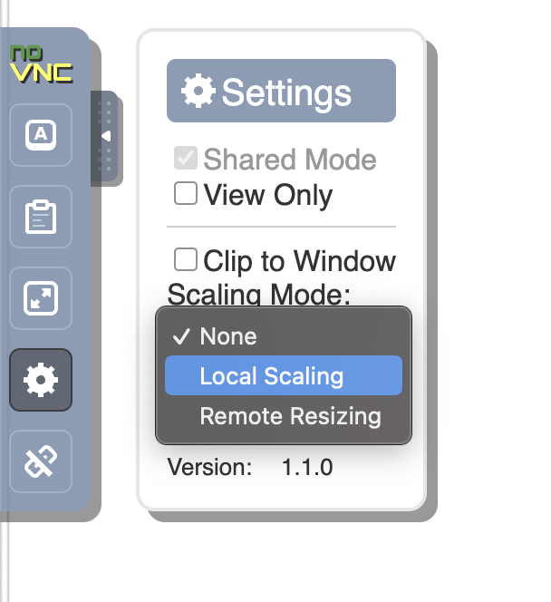
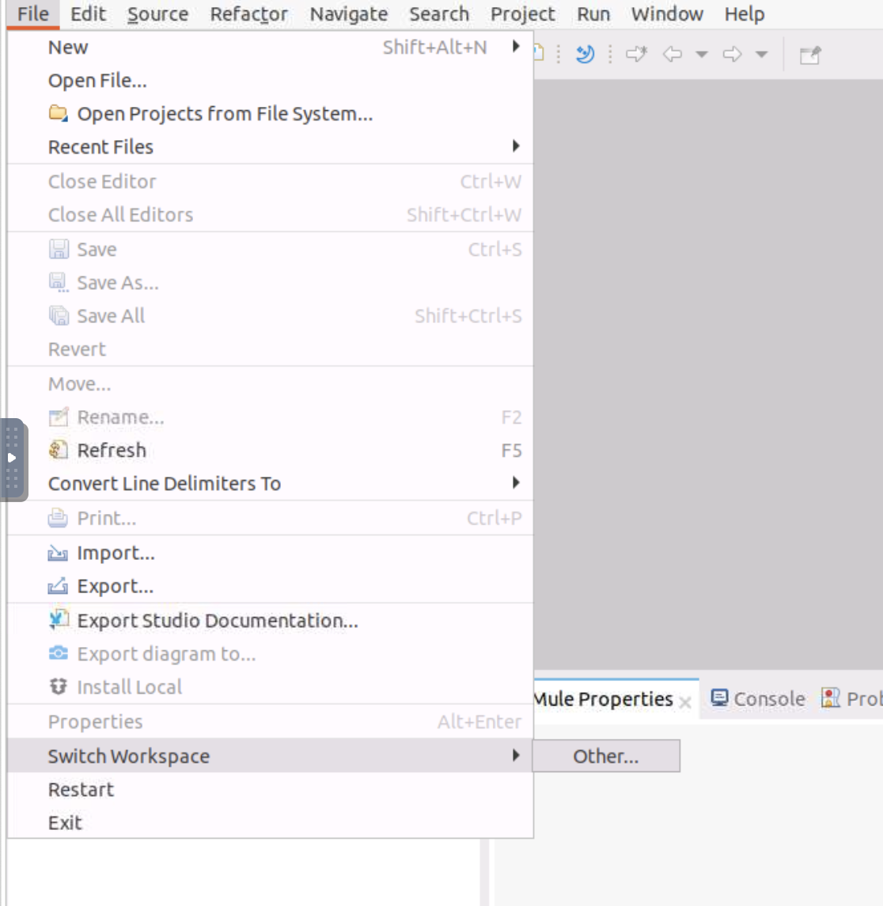
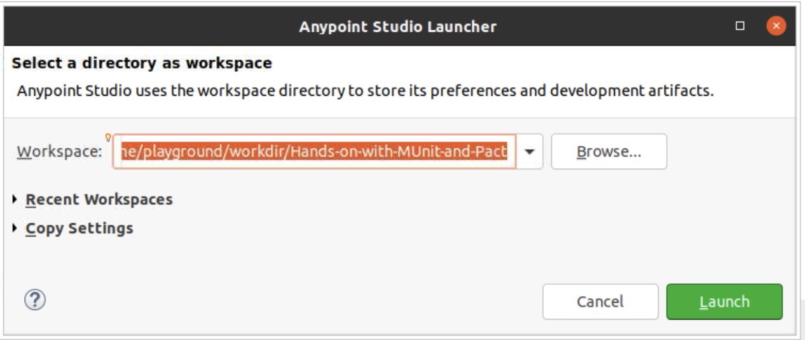
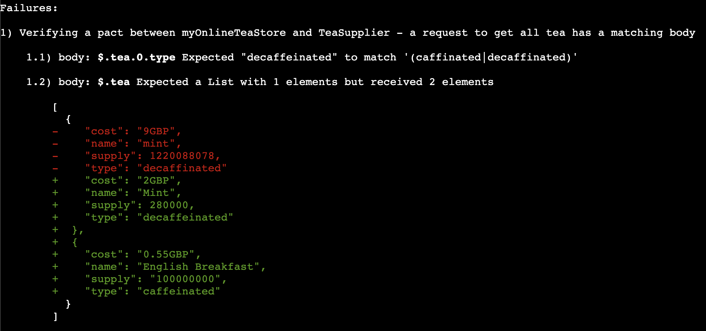
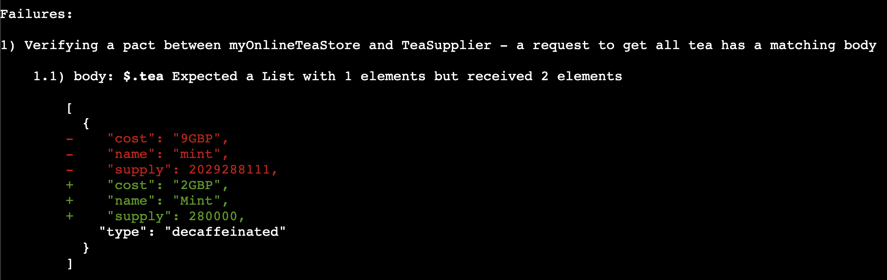
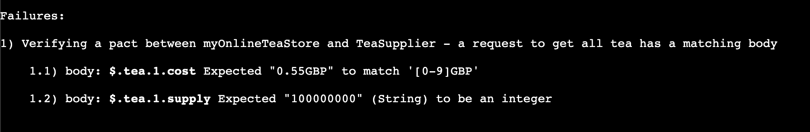

# Hands-on-with-MUnit-and-Pact

This repo is intended for the DevOps Playground Hands on with MUnit and Pact. During the DevOps Playground we provide a hosted infra that can be accessed by any web browser on your machine. You can find your instance on the day here: https://lab.devopsplayground.org/

Follow along with the presenter on the day, if you get stuck or fall behind, there are detailed steps below of what we will be doing. You can rewind or awatch back on YouTube if using your own machine at anytime. [LINK TO COME]

## Prerequisites (Your own machine)
This playground uses the following technology so you will need to make sure the following is setup on your machine:

1. Clone this Repo
1. Get an AnyPoint Studio Trial or Licence: https://www.mulesoft.com/lp/dl/anypoint-mule-studio
1. Install Java: https://www.java.com/download/
1. Install Maven: https://maven.apache.org/install.html
1. Download Pact Standalone JVM: 
1. Eclipse (maybe, sometimes get an error about needing Eclipse installed for Windows): https://eclipseide.org/

***Network***
The following ports will be used for the application and testing:
- 8081 -> consumer api (my tea store)
- 8082 -> provider api (tea supplier)

## Getting Started with the Playground
The playground uses MuleSoft with Mule 4 and version 4 of pact with specification version 3. 

**Good programming terms to know**
Although no existing knowledge of Java will be needed for this playground it could be benificial to have basic knowledge about some terms used for programming. Such as:

- "Code block" a collection of lines of code in a function
- "Function/Method" how we call a certain set of code
- "Veriable" how we can save the data we are using
- "Class" how we can organise a group of functions together that are related to a similar purpose
- "Repo" is short for repository

**Good testing terms to know**
It might also be useful to know some common testing terms such as: 
- "Before test, Before suite, After test, After suite" when organising a test we might need to perform actions before and after the function we are testing is run in the test
- "Mocking/Mock data" the act of using production like data to emulate a real live service

**Good commands to know**
- `cd <dirName>` to move into a directory
- `cd ..` to move out of a directory
- `ls` to list directories and files of your current location
- `pwd` if you get lost where you are in the directories will give full path location

## About Pact

Pact allows you to define a contract between two ends of an API connection (or relationship). Pact refers to these as consumers and providers. The consumer is the consuming API, otherwise known as the "frontend" API. It is the side of the contract relationship that is making a request to another API. The provider is the API that is giving a service to be used by other APIs, otherwise known as the backend API.

Pact provides a DSL(Domain Specific Lanugage) for consumers to define the request they will make to a provider along with the response they expect back. This expectation is used to create the mock provider that is then played back to the real provider with the pact file that is produced.


<sup>Example diagram of the relationship architecture from docs.pact.io</sup>

## What we will be doing

This repo contains two APIs. One API is a "Tea Store" that currently makes simple requests to the "Tea Supplier". 

The endpoints available are:
- GET /tea/supply | returns all tea
- GET /tea/supply/{name} | returns the requested tea
- POST /tea/order | Place an order to buy tea

Example output of the tea is as follows:
```JSON
{
	"tea": [
		{
			"name": "Mint",
			"type": "decaffeinated",
			"supply": 280000,
			"cost": "2GBP"
		},
		{
			"name": "English Breakfast",
			"type": "caffeinated",
			"supply": 100000000,
			"cost": "0.55GBP"
		}
	]
}
```

First to note is that tea is an array of objects. Tea can only be caffinated or decaffinated. Cost is given as GBP and supply is an integer. 

The `/tea/supply/{name}` endpoint will just return that tea object, for example:

```JSON
{
    "name": "English Breakfast",
    "type": "caffeinated",
    "supply": 100000000,
    "cost": "0.55GBP"
}
```

Finally, `/tea/order` should take a request object with "name" and "amount". The endpoint on success should return an object like below JSON example.
```JSON
{
    "id": 1,
    "name": "Mint",
    "amount": 200,
    "cost": "400GBP"
}
```

## 1. Setup the Environment

Go to your VNC in the browser located at <YOUR-PANDA>.devopsplayground.org:6080/vnc.html

When on the VNC, dismiss the popups and continue through the Linux setup. Then edit the scaling of the VNC to local.



In the repo there is already one test setup. Before we can run the test, we first need to setup the AnyPoint workspace and import the Mule projects. 

To setup the workspace, we need to open anypoint studio located in `/Home/AnypointStudio`. Click on the `Anypoint Studio` application. This will open a window asking to set up your workspace. 

For the playground Anypoint Studio instance it **must** be set to the following directory: `/Home/workdir/Hands-on-with-MUnit-and-Pact`. Otherwise there will be an issue with the projects not displaying. 

Set the workspace to the directory like the image below making sure the work directory is set to `/Home/workdir/Hands-on-with-MUnit-and-Pact`.


Now the workspace is set, all we need to do is start to import the two projects. Go to `File -> Import`. 


Then select `Anypoint Studio -> Anypoint Studio project from File System`.


For first time setup you may encounter a blank screen instead of being given the contents of the directory.


To resolve this issue click "Cancel" and go to `File -> Switch Workspace -> Other`.



Click on `Launch` on the popup after checking it is set to the correct workspace. This will relaunch Anypoint Studio.



After this try to Import the project again through `File -> Import`. Then select `Anypoint Studio -> Anypoint Studio project from File System`.

After clicking next, select the project `pact-munit-example` to have the screen below.


Make sure to then untick the box `Copy project into workspace` to prevent any naming errors. 


Now we have the `pact-munit-example` project imported. We need to repeat the same steps for the `tea-supplier` project. Follow the same steps above but changing the directory. 


### 1.1 Running a test

To run the MUnit test find and open the file `pact-munit-example/src/test/munit/get-tea-test-suite.xml`. We can see the test has already been setup. Now right click and run the test by clicking on the option `Run MUnit Suite`.


You will see the below error output in the terminal. This is because we are missing an environment variable. 


To setup the environment variable we will need to go to `Run -> Run Configurations...`. 


Next we add the environment variable `env` with the value `local`.


> Sometimes there are issues with inputing text into the field with the Playground instance. When this happens, typing into a text file on your machine and then going back to the instance and try again. It should then for some reason, let you now type into the box. 


When you have successfully entered the envrionment variable, run the test again. This time it should pass. 


The Pact file will be created under: `./pact-munit-example/target/pacts/myOnlineTeaStore-teaSupplier.json`. Open the file and take a look at it. 

### 1.2 Running the provider verification


We will get an output of `STATUS -> FAILED`. This is to be expected. Similar to the `pact-example-munit` project, we also need to set the environment variable again for the Tea Supplier. 


Go to `Run Configuration` and click on `Environment`. Add the variable `env` with the value `local`.


Now run the application again by right click -> `Run`. This time we should see `STATUS -> DEPLOYED`


Now we need to go to the Wetty terminal to run the provider test with the pact file. Go to <YOUR-PANDA>.devopsplayground.org/wetty

Make sure you are in the /Home/workdir/Hands-on-with-MUnit-and-Pact/tea-supplier directory. Check this by running `pwd`. If not in the correct directory then run `cd workdir/Hands-on-with-MUnit-and-Pact/tea-supplier`.

In the terminal enter the command `mvn pact:verify`. It might take some time as it will need to download the plugin. When it is done you should see output like the below image.


We can see there are some failures with the response body not being as expected.  

- 1.1) body: $.tea.0.cost Expected "2GBP" (String) to be an integer

- 1.2) body: $.tea.0.type Expected "decaffeinated" to match '(caffinated|decaffinated)'

- 1.3) body: $.tea Expected a List with 1 elements but received 2 elements

This is an example of the DSL setup not being correct. So we will need to see what the issue is. 

## 2. Fixing the contract verification 

The first Error 1.1 with the currancy is to do with our mock data we have used for the consumer test. If we open the file `pact-munit-example/src/main/java/pact/TeaBuilder.java` then go to the function `getTea`. You should see the following code: 

```Java
public static String getTea() {
	providerResponseBody = new PactDslJsonBody();
		
	((PactDslJsonBody) providerResponseBody)
		.array("tea")
			.object()
			    .stringType("name", "mint")
				.stringMatcher("type", "(caffinated|decaffinated)")
				.integerType("supply")
				.integerType("cost")
			.closeObject()
		.closeArray();
		
	return "";
}
```

Here we can see we have put "cost" as an integer, we need to change this to `stringMatcher`. We will use regex instead to ensure the cost form is correct.

`.stringMatcher("cost", "[0-9]GBP")`

Follow the below steps to update the pact file. 

1. Save the changes
1. Run the MUnit tests with right-click run `pact-munit-example/src/test/munit/get-tea-test-suite.xml`
1. Run the tea-service with right-click run `tea-supplier/src/main/mule/tea-supplier.xml`
1. In the wetty terminal run the command `mvn pact:verify`

There should now be one less error returned.



Next we need to fix the regex for the Caffeinated or Decaffeinated. Update `TeaBuilder` `getTea()` function again with:

`stringMatcher("type", "caffeinated|decaffeinated")`

Follow the run refresh steps again:

1. Save the changes
1. Run the MUnit tests with right-click run `pact-munit-example/src/test/munit/get-tea-test-suite.xml`
1. Run the tea-service with right-click run `tea-supplier/src/main/mule/tea-supplier.xml`
1. In the wetty terminal run the command `mvn pact:verify`

Now we should be left with only one error about the amount of items returned. 



This is because two objects are returned in the array but we are only expecting one. This means we need to use `minArrayLike()` where we can say each object in the array must meet the matchers and there should be minimum on one returned.

The updated `getTea()` function should look like this:

```Java
public static String getTea() {
	providerResponseBody = new PactDslJsonBody();
		
	((PactDslJsonBody) providerResponseBody)
			.minArrayLike("tea", 1)
					.stringType("name", "mint")
					.stringMatcher("type", "caffeinated|decaffeinated")
					.integerType("supply")
					.stringMatcher("cost", "[0-9]GBP")
				.closeObject()
			.closeArray();
		
	return "";
}
```

Now follow the same steps again to see if the updates are now correct.

1. Save the changes
1. Run the MUnit tests with right-click run `pact-munit-example/src/test/munit/get-tea-test-suite.xml`
1. Run the tea-service with right-click run `tea-supplier/src/main/mule/tea-supplier.xml`
1. In the wetty terminal run the command `mvn pact:verify`

Ok, so we have now removed the orginial errors. However, now because it is checking all objects over the just the first object we have some more errors. One is a consumer side error and the other is a Provider error. 



Lets finish the consumer side error first. With the value `0.55GBP` that is returned, we can see that decimal numbers are allowed. Our regex for cost only allowed for 0-9 numbers. We need to update this with correct regex in `TeaBuilder.getTea()`. 

The regex for cost will need to be updated with `.stringMatcher("cost", "\\d+\\.?\\d*GBP")`. 

Follow the same steps as before:

1. Save the changes
1. Run the MUnit tests with right-click run `pact-munit-example/src/test/munit/get-tea-test-suite.xml`
1. Run the tea-service with right-click run `tea-supplier/src/main/mule/tea-supplier.xml`
1. In the wetty terminal run the command `mvn pact:verify`

Now in the wetty terminal there should only be the provider error message returned. 

`1.1) body: $.tea.1.supply Expected "100000000" (String) to be an integer`

The provider error is easy to resolve as we are using mock data for our provider in place of a database connection. Go to the following file `tea-supplier/src/main/resources/getTea/all_tea_mock.dwl` and remove the quotes from the supply in order to make it a number. 

It should look like this: 

```JSON
{
	"tea": [
		{
			"name": "Mint",
			"type": "decaffeinated",
			"supply": 280000,
			"cost": "2GBP"
		},
		{
			"name": "English Breakfast",
			"type": "caffeinated",
			"supply": 100000000,
			"cost": "0.55GBP"
		}
	]
}
```

Follow the steps again to run:

1. Save the changes
1. Run the MUnit tests with right-click run `pact-munit-example/src/test/munit/get-tea-test-suite.xml`
1. Run the tea-service with right-click run `tea-supplier/src/main/mule/tea-supplier.xml`
1. In the wetty terminal run the command `mvn pact:verify`

Now we should see Passed in the wetty terminal!

## [Bonus] Running with the Pact Broker
To use the pact broker with this solution you will need to make a few small changes. 

The first change to make is to set the broker url. Navigate to the `./pact-munit-example/src/main/java/pact/PactService.java` file and locate the function `startPactService()`. Here we will add two lines of code after the port configuration to pass the broker URL. 

> You can run a [Pact Broker](https://docs.pact.io/pact_broker) with [docker](https://docs.pact.io/pact_broker/docker_images), the [cli](https://docs.pact.io/pact_broker/client_cli) or by using [PactFlow](https://docs.pact.io/pact_nirvana). See here for detailed documentation on how to setup the broker: 

```Java
public static Process startPactService() throws IOException, InterruptedException {
        String command = "sh " 
			+ System.getProperty("user.dir") 
			+ "/pact-jvm-server-4.1.42/bin/pact-jvm-server "
            + pactServicePort
            + " -l "
            + mockPactServerPort
            + " -u "
            + mockPactServerPort
            + " -b "
            + brokerUrl
            + " -v 3";
		
        pactService = Runtime.getRuntime().exec(command);
		printServiceResponse();

        return pactService;
    }
```

This will now no longer save pact files locally but instead hold them in memory until the `/publish` endpoint is hit to send the files up to the broker. 

With this we will now need to write an API call to the `/publish` endpoint of the Pact Server. This should be run either after the "Write Pact File" code block or in the "After Test" stage. 

In the file `pact-munit-example/src/main/java/pact/PactMockServer.java` add the following function to the `PactMockServer` class.

```Java
public static void publishPactFile(String pactArgs) throws ClientProtocolException {
			client = HttpClients.createDefault();
			HttpPost post = new HttpPost("http://localhost:" + pactServicePort + "/publish");
			JSONObject pactSetup = new JSONObject(pactArgs);
			JSONObject requestBody = new JSONObject();
			ResponseHandler<String> handler = new BasicResponseHandler();
	
			requestBody.put("consumer", (String) pactSetup.get("consumer"));
			requestBody.put("consumerVersion", (String) pactSetup.get("consumerVersion"));
			requestBody.put("provider", (String) pactSetup.get("provider"));
			
			post.setHeader("Content-Type", "application/json");
			
			try {
				post.setEntity(new StringEntity(requestBody.toString()));
				String body = client.execute(post, handler);
				System.out.println("Request Pact Body: " + body);
			    	    
			    close();
			} catch (IOException e) {
				System.out.println(e.getMessage());
			}	    
	}
```