# Hands-on-with-MUnit-and-Pact

This repo is intended for the DevOps Playground Hands on with MUnit and Pact. During the DevOps Playground we provide a hosted infra that can be accessed by any web browser on your machine. You can find your instance on the day here: https://lab.devopsplayground.org/

Follow along with the presenter on the day, if you get stuck or fall behind, there are detailed steps below of what we will be doing. You can rewind or awatch back on YouTube if using your own machine at anytime. [LINK TO COME]

## Prerequisites (Your own machine)
This playground uses the following technology so you will need to make sure the following is setup on your machine:

1. Clone this Repo
1. Get an AnyPoint Studio Trial or Licence: https://www.mulesoft.com/lp/dl/anypoint-mule-studio
1. Install Java: https://www.java.com/download/
1. Install Maven: https://maven.apache.org/install.html
1. Download Pact Standalone JVM: 
1. Eclipse (maybe, sometimes get an error about needing Eclipse installed for Windows): https://eclipseide.org/

***Network***
The following ports will be used for the application and testing:
- 8081 -> consumer api (my tea store)
- 8082 -> provider api (tea supplier)

## Getting Started with the Playground
The playground uses MuleSoft with Mule 4 and version 4 of pact with specification version 3. 

**Good programming terms to know**
Although no existing knowledge of Java will be needed for this playground it could be benificial to have basic knowledge about some terms used for programming. Such as:

- "Code block" a collection of lines of code in a function
- "Function/Method" how we call a certain set of code
- "Veriable" how we can save the data we are using
- "Class" how we can organise a group of functions together that are related to a similar purpose
- "Repo" is short for repository

**Good testing terms to know**
It might also be useful to know some common testing terms such as: 
- "Before test, Before suite, After test, After suite" when organising a test we might need to perform actions before and after the function we are testing is run in the test
- "Mocking/Mock data" the act of using production like data to emulate a real live service

**Good commands to know**
- `cd <dirName>` to move into a directory
- `cd ..` to move out of a directory
- `ls` to list directories and files of your current location
- `pwd` if you get lost where you are in the directories will give full path location

## About Pact

Pact allows you to define a contract between two ends of an API connection (or relationship). Pact refers to these as consumers and providers. The consumer is the consuming API, otherwise known as the "frontend" API. It is the side of the contract relationship that is making a request to another API. The provider is the API that is giving a service to be used by other APIs, otherwise known as the backend API.

Pact provides a DSL(Domain Specific Lanugage) for consumers to define the request they will make to a provider along with the response they expect back. This expectation is used to create the mock provider that is then played back to the real provider with the pact file that is produced.


<sup>Example diagram of the relationship architecture from docs.pact.io</sup>

## What we will be doing

This repo contains two APIs. One API is a "Tea Store" that currently makes simple requests to the "Tea Supplier". 

The endpoints available are:
- GET /tea/supply | returns all tea
- GET /tea/supply/{name} | returns the requested tea
- POST /tea/order | Place an order to buy tea

Example output of the tea is as follows:
```JSON
{
	"tea": [
		{
			"name": "Mint",
			"type": "decaffeinated",
			"supply": 280000,
			"cost": "2GBP"
		},
		{
			"name": "English Breakfast",
			"type": "caffeinated",
			"supply": 100000000,
			"cost": "0.55GBP"
		}
	]
}
```

First to note is that tea is an array of objects. Tea can only be caffinated or decaffinated. Cost is given as GBP and supply is an integer. 

The `/tea/supply/{name}` endpoint will just return that tea object, for example:

```JSON
{
    "name": "English Breakfast",
    "type": "caffeinated",
    "supply": 100000000,
    "cost": "0.55GBP"
}
```

Finally, `/tea/order` should take a request object with "name" and "amount". The endpoint on success should return an object like below JSON example.
```JSON
{
    "id": 1,
    "name": "Mint",
    "amount": 200,
    "cost": "400GBP"
}
```

## 1. Setup the Environment

In the repo there is already one test setup. Before we can run the test, we first need to setup the AnyPoint workspace and import the Mule projects. 

To setup the workspace, we need to open anypoint studio located in `/Home/AnypointStudio`. Click on the `Anypoint Studio` application. This will open a window asking to set up your workspace. 

> For the playground Anypoint Studio instance it **must** be set to the following directory: `/Home/workdir/Hands-on-with-MUnit-and-Pact`. Otherwise there will be an issue with the projects not displaying. 

Set the workspace to the directory like the image below.

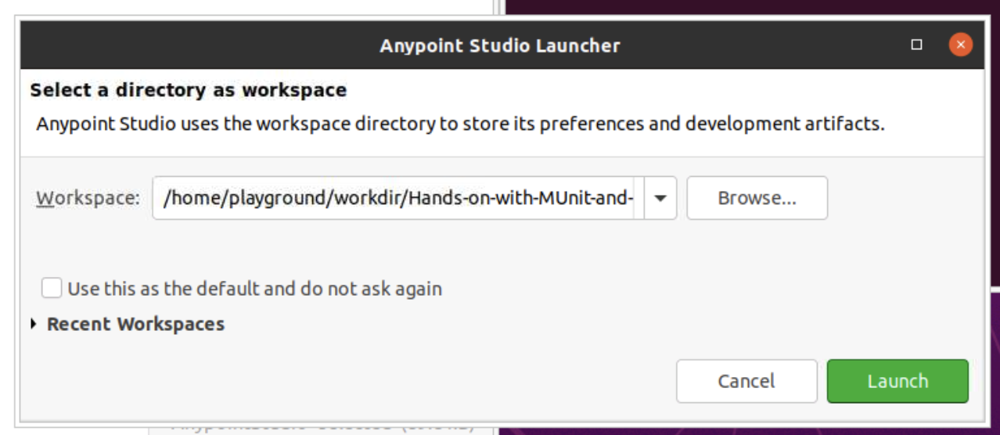

Now the workspace is set, all we need to do is start to import the two projects. Go to `File -> Import` or click the Import Project on the side. 

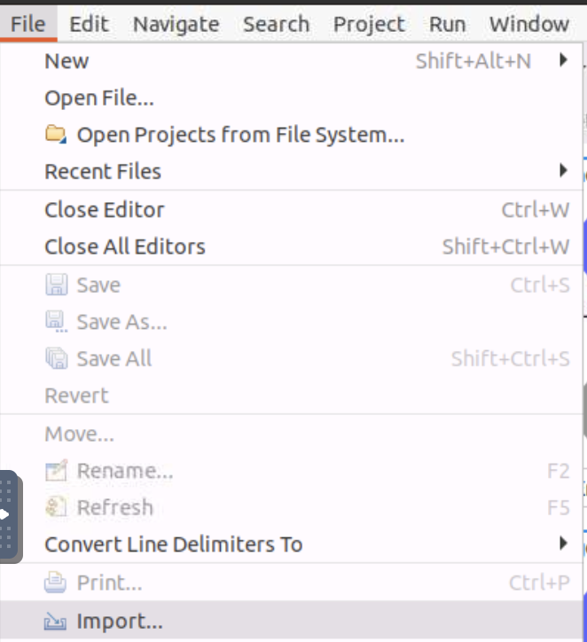

Then select `Anypoint Studio -> Anypoint Studio project from File System`.

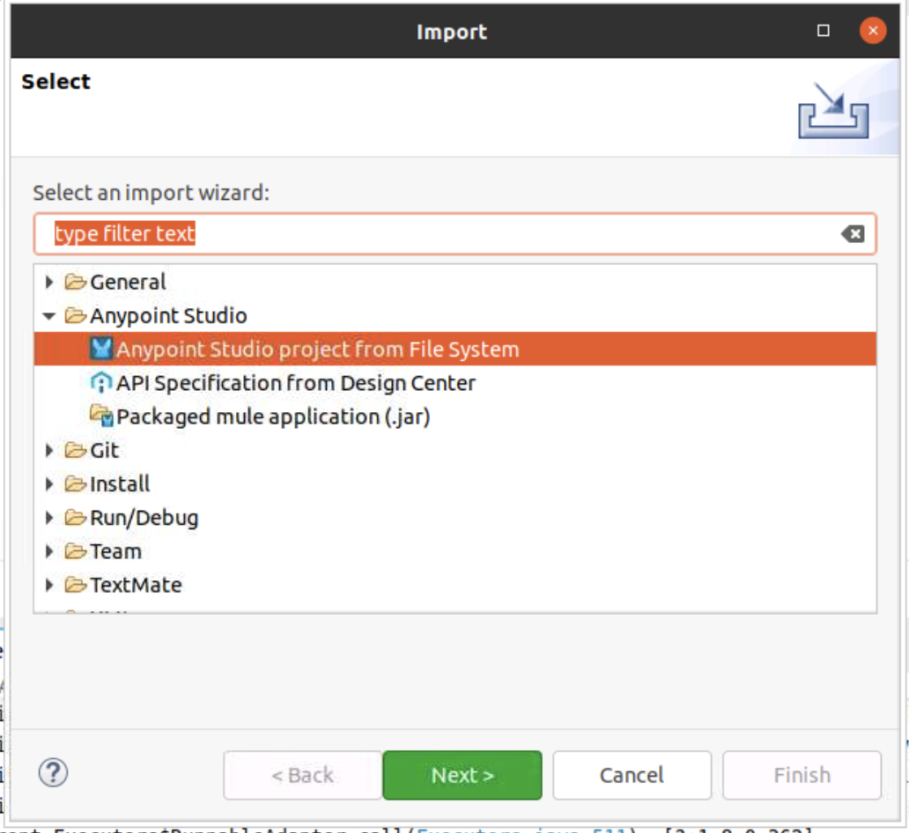

After clicking next, select the project `pact-munit-example` to have the screen below.

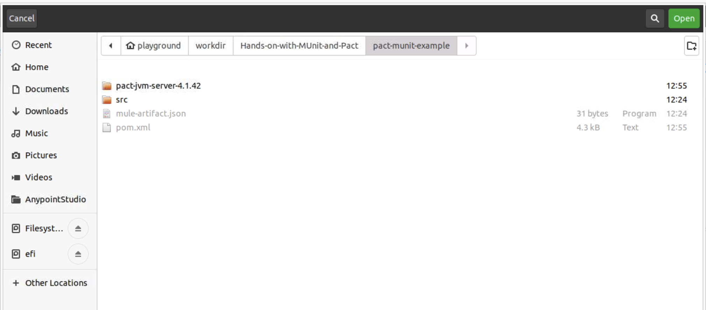

Make sure to then untick the box `Copy project into workspace` to prevent any naming errors. 

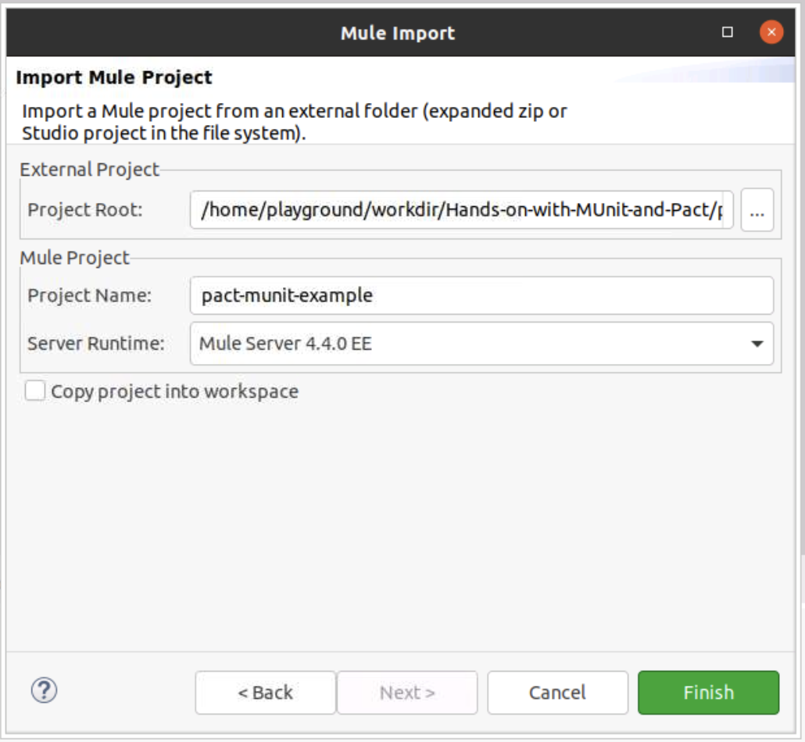

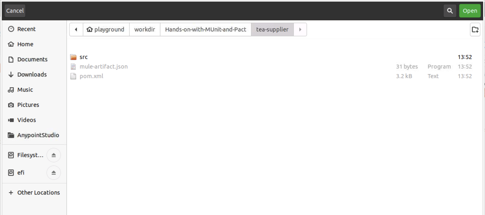

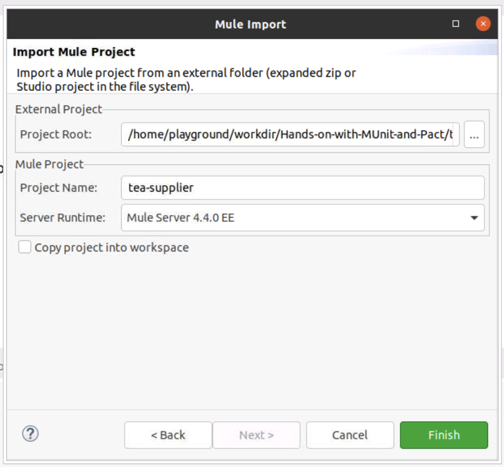

### 1.1 Running a test

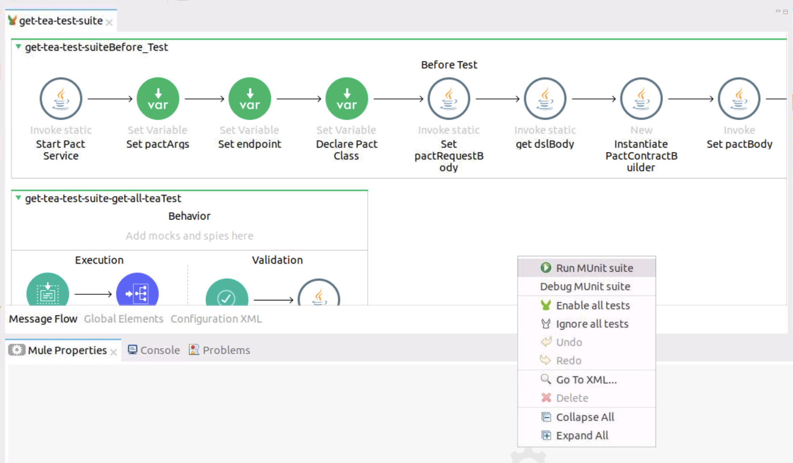

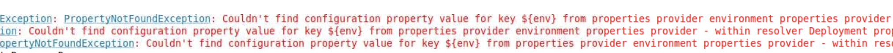


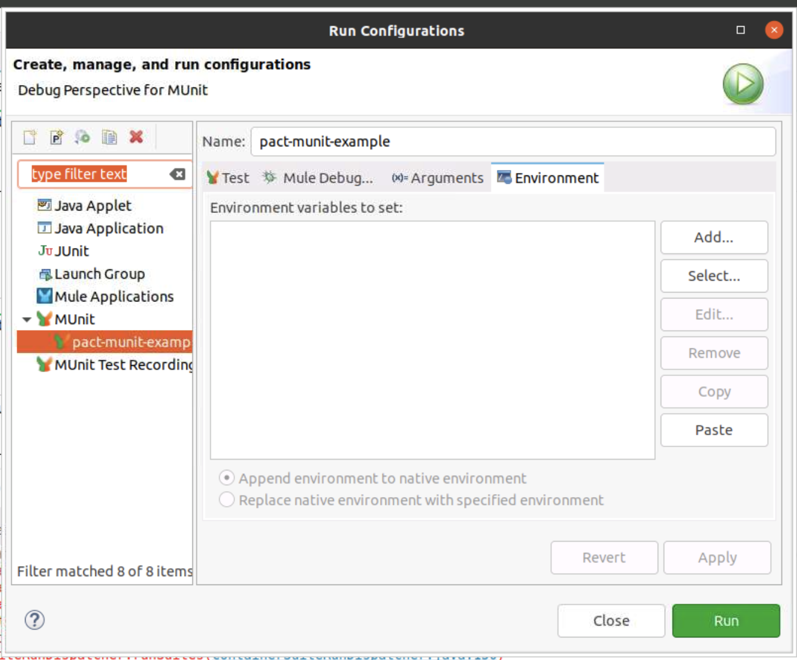

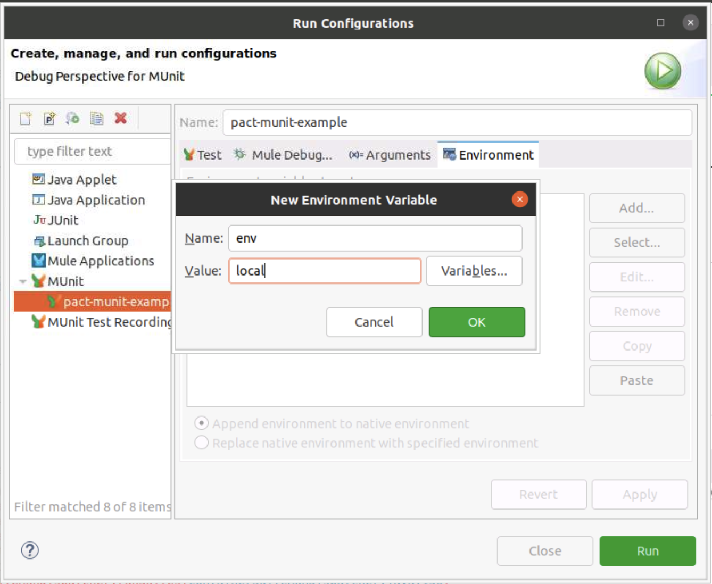

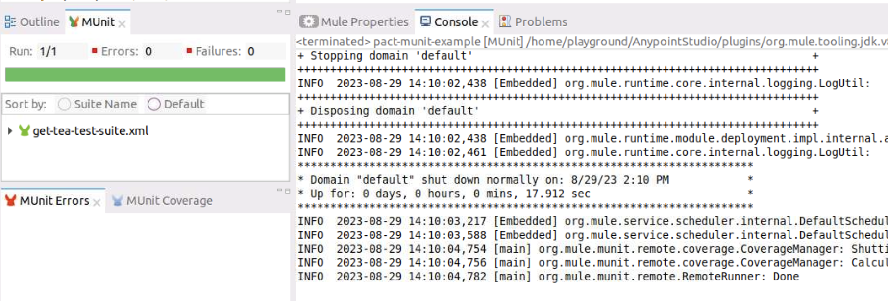

### 1.2 Running the provider verification

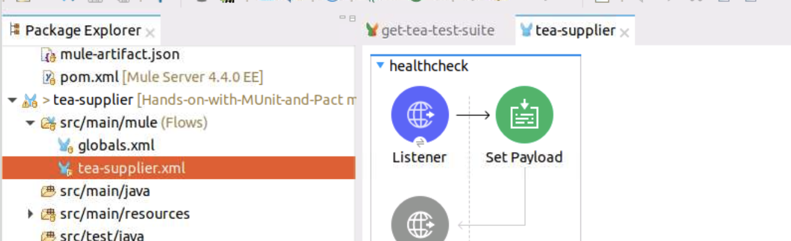

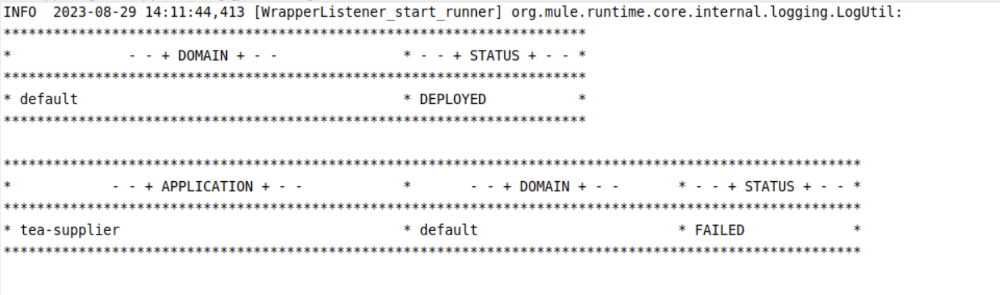

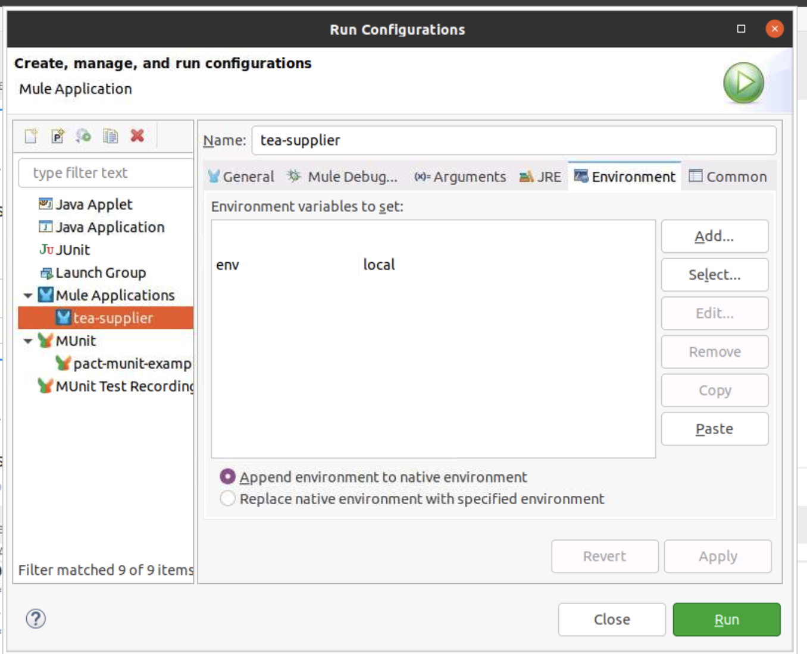

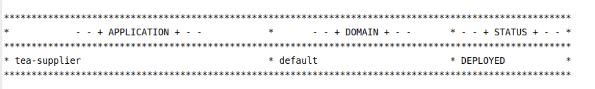

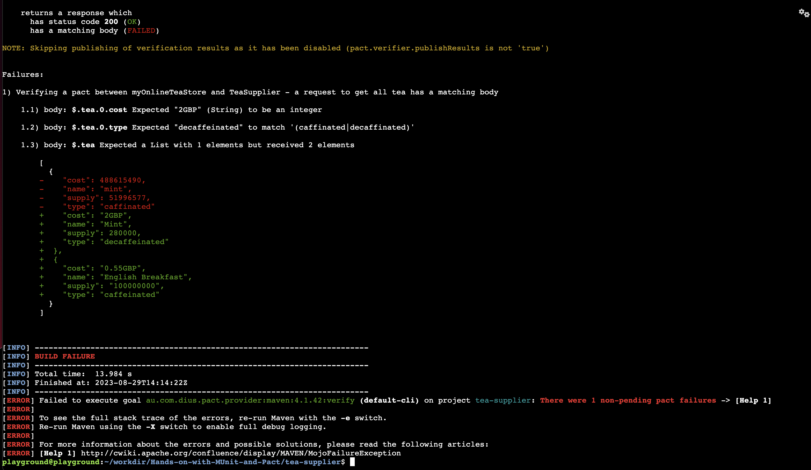

## 2. Fixing the contract verification 

## 3. Writing more tests for each method


## [Bonus] Running with the Pact Broker
To use the pact broker with this solution you will need to make a few small changes. 

The first change to make is to set the broker url. Navigate to the `./pact-munit-example/src/main/java/pact/PactService.java` file and locate the function `startPactService()`. Here we will add two lines of code after the port configuration to pass the broker URL. 

> You can run a [Pact Broker](https://docs.pact.io/pact_broker) with [docker](https://docs.pact.io/pact_broker/docker_images), the [cli](https://docs.pact.io/pact_broker/client_cli) or by using [PactFlow](https://docs.pact.io/pact_nirvana). See here for detailed documentation on how to setup the broker: 

```Java
public static Process startPactService() throws IOException, InterruptedException {
        String command = "sh " 
			+ System.getProperty("user.dir") 
			+ "/pact-jvm-server-4.1.42/bin/pact-jvm-server "
            + pactServicePort
            + " -l "
            + mockPactServerPort
            + " -u "
            + mockPactServerPort
            + " -b "
            + brokerUrl
            + " -v 3";
		
        pactService = Runtime.getRuntime().exec(command);
		printServiceResponse();

        return pactService;
    }
```

This will now no longer save pact files locally but instead hold them in memory until the `/publish` endpoint is hit to send the files up to the broker. 

With this we will now need to write an API call to the `/publish` endpoint of the Pact Server. This should be run either after the "Write Pact File" code block or in the "After Test" stage. 

In the file `pact-munit-example/src/main/java/pact/PactMockServer.java` add the following function to the `PactMockServer` class.

```Java
public static void publishPactFile(String pactArgs) throws ClientProtocolException {
			client = HttpClients.createDefault();
			HttpPost post = new HttpPost("http://localhost:" + pactServicePort + "/publish");
			JSONObject pactSetup = new JSONObject(pactArgs);
			JSONObject requestBody = new JSONObject();
			ResponseHandler<String> handler = new BasicResponseHandler();
	
			requestBody.put("consumer", (String) pactSetup.get("consumer"));
			requestBody.put("consumerVersion", (String) pactSetup.get("consumerVersion"));
			requestBody.put("provider", (String) pactSetup.get("provider"));
			
			post.setHeader("Content-Type", "application/json");
			
			try {
				post.setEntity(new StringEntity(requestBody.toString()));
				String body = client.execute(post, handler);
				System.out.println("Request Pact Body: " + body);
			    	    
			    close();
			} catch (IOException e) {
				System.out.println(e.getMessage());
			}	    
	}
```